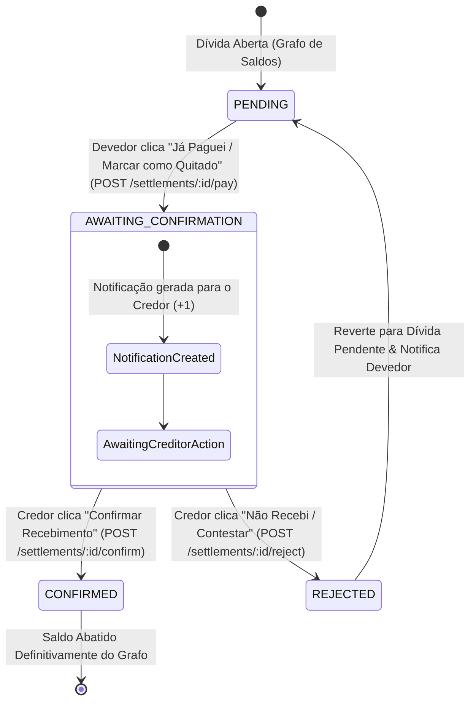

# 📄 Documento de Especificação Técnica (SDD Phase 2 Addendum)
## Módulo de Liquidação: Geração de Link Pix e Quitação em Duas Vias (Two-Way Handshake)

**Projeto:** Racho - Gestão de Despesas & Otimização de Dívidas  
**Versão:** 2.2.0-delta  
**Data:** 07/10/2026  
**Autor:** Engenheiro de Software Sênior  
**Status:** AGUARDANDO_REVISAO  

---

## 1. Contexto & Objetivos

Este aditivo ao SDD Phase 2 especifica o mecanismo de **Quitação em Duas Vias (Two-Way Handshake)** e o **Sistema de Notificações Simplificado (+1)** para as liquidações do Racho. O objetivo é substituir a liquidação unidirecional instantânea por um fluxo seguro onde:
1. O **Devedor** sinaliza a realização do pagamento Pix/TED ("Já paguei / Marcar como Quitado").
2. O **Credor (Cobrador)** recebe uma notificação exclusiva em tempo real/polling `(+1)` para verificar o extrato bancário e **Confirmar Recebimento** ou **Contestar (Não Recebi)**.
3. O saldo do grupo é **consolidado e abatido do grafo estritamente após a confirmação do credor**.

---

## 2. Máquina de Estados da Liquidação (Settlement Lifecycle)

### 2.1 Diagrama de Transição de Estados (Mermaid)



### 2.2 Regras de Negócio e Permissões

- **Controle de Acesso Estrito (403 Forbidden):** Apenas os usuários diretamente envolvidos na transação (`payerId` / devedor e `receiverId` / credor) possuem autorização para alterar os estados da liquidação. Usuários terceiros pertencentes ao mesmo grupo recebem erro `403 Forbidden`.
- **Visibilidade no Grafo de Saldos:**
  - Em estado `AWAITING_CONFIRMATION`, a dívida ganha a tag visual *"Aguardando Confirmação do Credor"* na interface. O saldo líquido do grupo permanece inalterado até a transição para `CONFIRMED`.
  - Ao transicionar para `CONFIRMED`, o saldo é computado e abatido do grafo de dívidas.
  - Ao transicionar para `REJECTED`, a notificação pendente do credor é removida, o devedor recebe um alerta da contestação e a dívida reaparece aberta no grafo.

---

## 3. Sistema de Notificação Simplificada (+1)

### 3.1 Notificação Direcionada ao Cobrador (Credor)
Ao atingir o estado `AWAITING_CONFIRMATION`:
- Uma notificação leve é inserida na tabela `Notification` com `userId = receiverId`.
- Na barra de navegação/header do credor, o ícone de notificações exibe o badge contador dinâmico (ex: `Notificações (+1)`).

### 3.2 Estrutura Visual do Card de Notificação
No painel/drawer de Notificações do Credor:
- **Título:** `Solicitação de Confirmação de Pagamento`
- **Mensagem:** `"[Nome do Devedor] marcou o pagamento de R$ XX,XX como realizado no grupo [Nome do Grupo]"`
- **Ações Diretas no Card:**
  - `[✅ Confirmar Recebimento]` (Botão Verde): Executa `POST /groups/:groupId/settlements/:id/confirm`.
  - `[❌ Não Recebi / Contestar]` (Botão Vermelho/Outline): Executa `POST /groups/:groupId/settlements/:id/reject`.

---

## 4. Modelagem de Dados (Prisma Schema Update)

### 4.1 Enums

```prisma
enum SettlementStatus {
  PENDING
  AWAITING_CONFIRMATION
  CONFIRMED
  REJECTED
}

enum NotificationType {
  SETTLEMENT_AWAITING_APPROVAL
  SETTLEMENT_CONFIRMED
  SETTLEMENT_REJECTED
}
```

### 4.2 Tabela `Settlement` Atualizada

```prisma
model Settlement {
  id          String           @id @default(uuid())
  groupId     String
  payerId     String           // Devedor
  receiverId  String           // Credor / Cobrador
  amount      Int              // Valor em CENTAVOS
  currency    Currency         @default(BRL)
  status      SettlementStatus @default(PENDING)
  note        String?
  paidAt      DateTime?
  confirmedAt DateTime?
  rejectedAt  DateTime?
  createdAt   DateTime         @default(now())
  updatedAt   DateTime         @updatedAt

  group         Group          @relation(fields: [groupId], references: [id], onDelete: Cascade)
  payer         User           @relation("SettlementPayer", fields: [payerId], references: [id])
  receiver      User           @relation("SettlementReceiver", fields: [receiverId], references: [id])
  notifications Notification[]

  @@index([groupId])
  @@index([payerId])
  @@index([receiverId])
  @@map("settlements")
}
```

### 4.3 Tabela `Notification` (Novas Notificações Leves)

```prisma
model Notification {
  id           String           @id @default(uuid())
  userId       String           // Destinatário exclusivo da notificação
  settlementId String?          // Referência opcional à liquidação
  type         NotificationType
  title        String
  message      String
  read         Boolean          @default(false)
  createdAt    DateTime         @default(now())

  user       User        @relation(fields: [userId], references: [id], onDelete: Cascade)
  settlement Settlement? @relation(fields: [settlementId], references: [id], onDelete: Cascade)

  @@index([userId, read])
  @@map("notifications")
}
```

---

## 5. Contratos de API & Endpoints (Fastify + Zod + Prisma)

### 5.1 Endpoints de Liquidação (Settlement Actions)

#### 1. Iniciar/Marcar Pagamento Realizado (Ação do Devedor)
- **HTTP:** `POST /groups/:groupId/settlements/:id/pay`
- **Autorização:** Apenas `payerId === request.user.sub`.
- **Ação Transacional:**
  1. Atualiza `status` para `AWAITING_CONFIRMATION` e preenche `paidAt = now()`.
  2. Cria registro em `Notification` para `receiverId` com tipo `SETTLEMENT_AWAITING_APPROVAL`.
- **Respostas:** `200 OK` `{ settlement, notification }`, `403 Forbidden`.

#### 2. Confirmar Recebimento (Ação do Credor)
- **HTTP:** `POST /groups/:groupId/settlements/:id/confirm`
- **Autorização:** Apenas `receiverId === request.user.sub`.
- **Ação Transacional:**
  1. Atualiza `status` para `CONFIRMED` e preenche `confirmedAt = now()`.
  2. Marca a notificação vinculada como `read = true`.
  3. Gera `AuditLog` (`CREATE_SETTLEMENT`) e consolida o abate do saldo no grafo de dívidas do grupo.
- **Respostas:** `200 OK` `{ settlement }`, `403 Forbidden`.

#### 3. Contestar / Não Recebi (Ação do Credor)
- **HTTP:** `POST /groups/:groupId/settlements/:id/reject`
- **Autorização:** Apenas `receiverId === request.user.sub`.
- **Ação Transacional:**
  1. Atualiza `status` para `REJECTED` (que reverte para dívida pendente no cálculo do grafo) e preenche `rejectedAt = now()`.
  2. Cria notificação de aviso para o devedor (`payerId`) informando a contestação.
- **Respostas:** `200 OK` `{ settlement }`, `403 Forbidden`.

### 5.2 Endpoints de Notificação (Badge Light Polling)

#### 1. Contador de Notificações Não Lidas
- **HTTP:** `GET /notifications/unread-count`
- **Headers:** `Authorization: Bearer <token>`
- **Resposta:** `200 OK` `{ unreadCount: number }`

#### 2. Listagem de Notificações do Usuário
- **HTTP:** `GET /notifications`
- **Headers:** `Authorization: Bearer <token>`
- **Resposta:** `200 OK` `{ notifications: NotificationResponse[] }`

#### 3. Marcar Notificação como Lida
- **HTTP:** `PATCH /notifications/:id/read`
- **Resposta:** `200 OK` `{ success: true }`

---

## 6. Matriz de Testes e Casos de Uso (Given / When / Then)

| ID | Caso de Uso / Cenário | Dado que (Given) | Quando (When) | Então (Then) |
| :--- | :--- | :--- | :--- | :--- |
| **UC-HANDSHAKE-01** | **Devedor Marca como Pago e Credor Recebe Incremento +1** | Existe uma dívida de **R$ 35,50** entre Diego (devedor) e Shirley (credora). | Diego clica em "Já Paguei / Marcar como Quitado" (`POST /pay`). | O status muda para `AWAITING_CONFIRMATION`, o contador de notificações de Shirley recebe `+1` e o saldo permanece pendente de confirmação no grafo. |
| **UC-HANDSHAKE-02** | **Credor Confirma Recebimento e Abate Saldo** | Existe uma liquidação em `AWAITING_CONFIRMATION`. | Shirley clica em "Confirmar Recebimento" (`POST /confirm`). | O status muda para `CONFIRMED`, a notificação é baixada (`read = true`), o saldo de R$ 35,50 é abatido do grupo e gravado no audit log. |
| **UC-HANDSHAKE-03** | **Rejeição por Terceiro Não Autorizado (403)** | Existe uma liquidação entre Diego e Shirley. O usuário Gustavo (terceiro no grupo) tenta aprovar ou contestar. | Gustavo dispara `POST /confirm` ou `/reject`. | A API bloqueia a requisição e retorna `403 Forbidden: Apenas os participantes da dívida podem alterar este status`. |
| **UC-HANDSHAKE-04** | **Credor Contesta Pagamento Não Recebido** | Existe uma liquidação em `AWAITING_CONFIRMATION`. | Shirley clica em "Não Recebi / Contestar" (`POST /reject`). | O status reverte para `REJECTED`, a dívida volta a figurar como pendente de pagamento no grafo e Diego recebe um alerta de contestação. |

---

## 7. Próximos Passos (Aguardando Aprovação)

Após a sua revisão e homologação deste aditivo ao SDD:
1. Atualizaremos o `schema.prisma` com `SettlementStatus`, `NotificationType` e a nova tabela `Notification`.
2. Criaremos os testes unitários e rotas de API no backend Fastify.
3. Desenvolveremos os componentes visuais do badge `(+1)` e drawer de notificações no Next.js 14.
